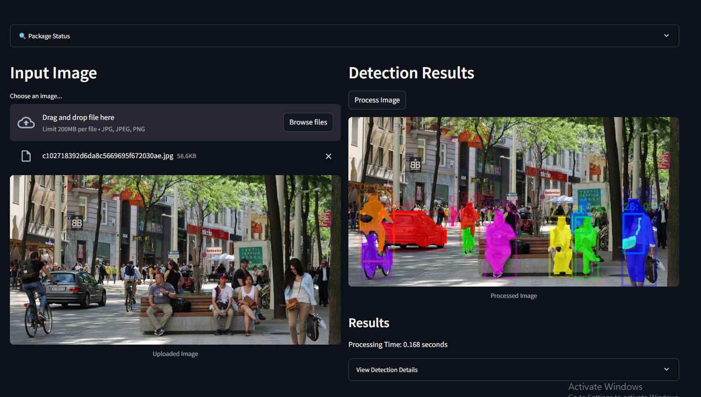

# YoloVisionAI



A computer vision project built with PyTorch and Streamlit for real-time object detection and analysis.

## Features

- Real-time object detection
- Interactive web interface using Streamlit
- Support for image and video processing
- Modern and user-friendly UI

## Prerequisites

- Python 3.11 or higher
- pip (Python package installer)

## Installation

1. Clone the repository:
```bash
git clone https://github.com/yourusername/YoloVisionAI.git
cd YoloVisionAI
```

2. Create a virtual environment (recommended):
```bash
python -m venv venv
source venv/bin/activate  # On Windows: venv\Scripts\activate
```

3. Install the required dependencies:
```bash
pip install -r requirements.txt
```

## Usage

1. Start the Streamlit application:
```bash
streamlit run app.py
```

2. Open your web browser and navigate to the URL shown in the terminal (typically http://localhost:8501)

3. Upload an image or video file through the web interface to start object detection

## Project Structure

```
YoloVisionAI/
├── app.py              # Main Streamlit application
├── requirements.txt    # Project dependencies
├── pyproject.toml      # Project configuration
└── README.md          # Project documentation
```

## Dependencies

- PyTorch >= 2.7.0
- OpenCV >= 4.11.0.86
- Streamlit >= 1.45.1
- NumPy >= 2.2.6
- Pandas >= 2.2.3
- Matplotlib >= 3.10.3
- Pillow >= 11.2.1

## Contributing

1. Fork the repository
2. Create your feature branch (`git checkout -b feature/AmazingFeature`)
3. Commit your changes (`git commit -m 'Add some AmazingFeature'`)
4. Push to the branch (`git push origin feature/AmazingFeature`)
5. Open a Pull Request

## License

This project is licensed under the MIT License - see the LICENSE file for details.

## Acknowledgments

- [PyTorch](https://pytorch.org/)
- [Streamlit](https://streamlit.io/)
- [OpenCV](https://opencv.org/) 